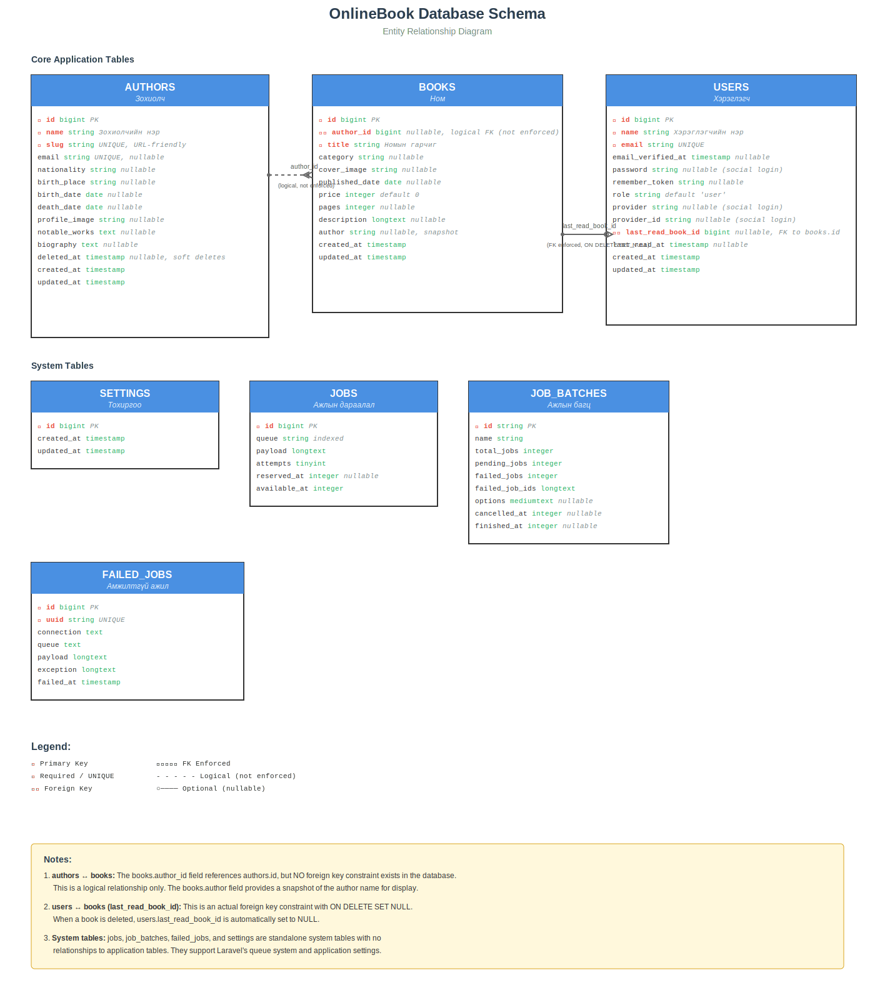

# OnlineBook Өгөгдлийн Санийн Бүтэц (ERD)

## Тойм

Энэ баримт бичиг нь OnlineBook веб аппликейшны өгөгдлийн санийн бүтцийг (Entity Relationship Diagram - ERD) харуулж байна. ERD нь Laravel migration файлуудаас үүсгэгдсэн бөгөөд системийн бүх хүснэгт болон тэдгээрийн хоорондын холбоог харуулна.

## Диаграм



## Хүснэгтүүд

### Үндсэн Аппликейшны Хүснэгтүүд

#### 1. **authors** (Зохиолч)
Номын зохиолчдын мэдээллийг хадгална.

**Гол талбарууд:**
- `id` - Үндсэн түлхүүр (Primary Key)
- `name` - Зохиолчийн нэр (шаардлагатай)
- `slug` - URL-д зориулсан давтагдашгүй нэр (UNIQUE)
- `email` - Имэйл хаяг (UNIQUE, nullable)
- `nationality` - Үндэс угсаа
- `birth_date`, `death_date` - Төрсөн болон нас барсан огноо
- `biography` - Товч намтар
- `deleted_at` - Зөөлөн устгах (soft delete)

#### 2. **books** (Ном)
Номуудын үндсэн мэдээллийг хадгална.

**Гол талбарууд:**
- `id` - Үндсэн түлхүүр
- `author_id` - Зохиолчийн ID (nullable, logical FK)
- `title` - Номын гарчиг (шаардлагатай)
- `category` - Ангилал
- `cover_image` - Хавтасны зураг
- `published_date` - Хэвлэгдсэн огноо
- `price` - Үнэ (анхдагч утга: 0)
- `pages` - Хуудасны тоо
- `description` - Тайлбар (longtext)
- `author` - Зохиолчийн нэрийн snapshot (багтаасан утга)

#### 3. **users** (Хэрэглэгч)
Системийн хэрэглэгчдийн мэдээллийг хадгална.

**Гол талбарууд:**
- `id` - Үндсэн түлхүүр
- `name` - Хэрэглэгчийн нэр
- `email` - Имэйл хаяг (UNIQUE)
- `password` - Нууц үг (nullable - нийгмийн сүлжээгээр нэвтрэх үед)
- `role` - Эрх (анхдагч: 'user')
- `provider`, `provider_id` - Нийгмийн сүлжээгээр нэвтрэх мэдээлэл
- `last_read_book_id` - Сүүлд уншсан номын ID (FK)
- `last_read_at` - Сүүлд уншсан цаг

### Системийн Хүснэгтүүд

#### 4. **settings** (Тохиргоо)
Системийн тохиргоог хадгалах хүснэгт.

#### 5. **jobs** (Ажлын Дараалал)
Laravel queue системийн ажлуудыг хадгална.

#### 6. **job_batches** (Ажлын Багц)
Багцалсан ажлуудын мэдээллийг хадгална.

#### 7. **failed_jobs** (Амжилтгүй Ажил)
Амжилтгүй болсон ажлуудын лог.

## Хүснэгтүүдийн Хоорондын Холбоо

### 1. authors ↔ books (Зохиолч - Ном)
- **Харьцаа:** Нэг зохиолч олон номтой холбогдож болно (1:N)
- **Тэмдэглэл:** Энэ нь **логик холбоо** бөгөөд өгөгдлийн санд `books.author_id` талбар нь `authors.id`-г заадаг боловч **foreign key constraint байхгүй**. Учир нь `books.author` талбар нь зохиолчийн нэрийг snapshot хэлбэрээр хадгалдаг.

### 2. users ↔ books (Хэрэглэгч - Ном)
- **Харьцаа:** Хэрэглэгч сүүлд уншсан номтой холбогдоно (0..1:1)
- **Тэмдэглэл:** Энэ нь **бодит foreign key** бөгөөд `ON DELETE SET NULL` горимтой ажилладаг. Ном устах үед хэрэглэгчийн `last_read_book_id` автоматаар NULL болно.

### 3. Системийн хүснэгтүүд
- `jobs`, `job_batches`, `failed_jobs`, `settings` хүснэгтүүд нь бусад аппликейшны хүснэгтүүдтэй шууд холбоогүй.
- Эдгээр нь Laravel-ын queue систем болон тохиргоог дэмжих системийн хүснэгтүүд юм.

## Диаграмыг Хэрхэн Шинэчлэх

### 1. Mermaid Эх Файлыг Засах

ERD-ийн эх код нь Mermaid хэлээр бичигдсэн бөгөөд `onlinebook-erd.mmd` файлд байрладаг.

```bash
# Mermaid файлыг засах
nano docs/erd/onlinebook-erd.mmd
```

### 2. SVG Үүсгэх

Mermaid файлаас SVG үүсгэхийн тулд:

**Сонголт 1: Mermaid CLI ашиглах**
```bash
# Mermaid CLI-г суулгах (хэрэв байхгүй бол)
npm install -g @mermaid-js/mermaid-cli

# SVG үүсгэх
mmdc -i docs/erd/onlinebook-erd.mmd -o docs/erd/onlinebook-erd.svg -t neutral -b transparent
```

**Сонголт 2: Онлайн хэрэгсэл ашиглах**
- [Mermaid Live Editor](https://mermaid.live/) руу очиж `.mmd` файлын агуулгыг paste хийж SVG татаж авах
- [Mermaid Chart](https://www.mermaidchart.com/) - илүү олон боломжтой онлайн хэрэгсэл

**Сонголт 3: Гараар засах**
- SVG файлыг шууд засаж болно (жишээ: өнгө, зураасны байршил г.м.)

### 3. PNG Хувилбар Үүсгэх (нэмэлт)

PNG файл шаардлагатай бол:

```bash
# SVG-ээс PNG руу хөрвүүлэх
mmdc -i docs/erd/onlinebook-erd.mmd -o docs/erd/onlinebook-erd.png -t neutral -b transparent
```

Эсвэл онлайн хөрвүүлэгч ашиглах: [CloudConvert](https://cloudconvert.com/svg-to-png)

## Migration Файлуудын Жагсаалт

Энэ ERD нь дараах идэвхтэй migration файлуудад үндэслэсэн:

- `database/migrations/2025_10_10_074729_create_books_table.php`
- `database/migrations/2025_10_10_080000_add_author_fk_to_books_table.php`
- `database/migrations/2025_11_08_000000_create_author_table.php`
- `database/migrations/2025_12_25_035106_add_social_fields_to_users_table.php`
- `database/migrations/2025_12_29_000100_add_last_read_to_users_table.php`
- `database/migrations/0001_01_01_000002_create_jobs_table.php`
- `database/migrations/2025_10_10_063420_add_role_to_users_table.php`
- `database/migrations/2025_10_10_074819_create_settings_table.php`

**Анхаар:** `.history/` фолдер болон `book_categories` хүснэгтийн migration (`2025_10_30_081000_create_book_categories_table.php`) нь буруу тул оруулаагүй.

## Нэмэлт Мэдээлэл

### Түлхүүр Тэмдэглэгээ
- 🔑 - Primary Key (Үндсэн түлхүүр)
- 🔒 - Required/UNIQUE (Шаардлагатай/Давтагдашгүй)
- ↗️ - Foreign Key (Гадаад түлхүүр)

### Холбооны Тэмдэглэгээ
- `━━━━━` - Enforced FK (Хүчээр дагуулсан гадаад түлхүүр)
- `- - - - -` - Logical (Логик холбоо, constraint байхгүй)
- `○────` - Optional/Nullable (Заавал биш)

## Асуулт, Санал

Хэрэв диаграмд өөрчлөлт хийх шаардлагатай бол:
1. Migration файлыг шинэчлэх
2. `docs/erd/onlinebook-erd.mmd` файлыг шинэчлэх
3. SVG дахин үүсгэх
4. Git-д оруулах

---

*Сүүлд шинэчилсэн: 2026-02-01*
